## 同济大学-Java软件开发

### 简介

该文档为同济大学经济管理学院管理科学与工程系，Java软件开发课程作业及本人的作业情况，任课老师为贺向东

### 各次小作业

#### D01 导论作业

主类文件命名规则：DXXTYY （XX 为第几次作业，本次为01，YY 为题号，对应本周分别为 01 02 03）

1、设计一个计算 类，包含 2个成员变量，5类成员方法实现对两个成员变量进行+ 、 —、* 、/、%的运算。

另外建立一个类，包含程序的执行 方法 main（）；main（）中实现 从外部输入一个简单的运算式，使用计算 类的方法完成计算后，结果从main（）方法 中 输出。

要求：每种方法用重载实现多种数据类型的自动匹配

2、设计一个类 ，包含2个方法，一个是 判断输入的数值是否是质数，一个是判断输入的三位数 是否 是 水仙花数 （个十百3位的数值的立方之和等于数值本身，也即是 abc=a^3+b^3+c^3）。

另外建立一个类，包含程序的执行 方法 main（）；main（）中实现 从外部输入一个数值，使用上面类的方法进行判断，如果是3位数，就判断是否是水仙花数，如果不是，判断是否是质数。结果从main（）方法 中 输出。

3、设计一个类，使用前一个已经建立的类；将1000以内的所有的质数存入到一个文件中，按照每行10个的格式输出。

提示：文件可以采用System类中的方法setout（） 将out 设定为文件prime.txt，输出直接采用system.out.print和system.out.println完成。

#### D02 运算符

运算符、控制语句

java 中的整型数据运算符有几个特殊应用方法：

%  判断是否能整除 

<< 、>> 左移和右移实现乘2和除2操作

^ 异或操作实现数据变换和恢复

1、实现运算 x=a*16，应用printf 和 scanner 实现多种样式的数据输入和格式化的输出。

2、计算 s=1+1/1！+1/2！+.......+1/n! ，最后的结果要求小数点后80位

提示：采用BigDecimal类可以实现精度提升

基本程序语句

1、计算sum=1！+2！+。。。+n！+。。。的n的临界值。sum的类型为int和long 2种类型。要求输出完整。

#### D03 输入输出

本次作业：设计一个类，使用之前已经建立的类；将1000以内的所有的质数存入到一个文件中，按照每行10个的格式输出。

提示：文件可以采用System类中的方法setout（） 将out 设定为文件prime.txt，输出直接采用system.out.print和system.out.println完成。扩展题目

2、一个文件data.txt中，包含如下内容

品名	价格	数量

苹果	5.5	100

桔子	3.3	87

识别出文件中数值。

为文件新增一列，总计，并在对应行写入对应的数值

新增一行，平均价格，并在同一行最右边，添加数值

提示：从文件中读入数据，可以采用将输入重定向为文件完成

#### D04 交互式输入输出

1、创建一个窗口，里面放置合适的控件。

要显示的数据放置在一个文件data.txt中，包含如下内容

品名	价格	数量

苹果	5.5	100

桔子	3.3	87

读入文件，将数据文件中的数据显示在控件中。

写入文件，将读入的数据计算得出总计并写入文件

2、设计一个界面，读入一个算术表达式；增加一个命令按钮“单步”

单步操作对应将运算表达式分解，并按照运算的顺序，每次执行一步，将运算操作数和运算符用控件 显示在窗口上。

可以使用作业一中已经创建完成的类来完成其中的分解工作。

增加一个按钮“存储”

将运算式和分布计算的细节，写入文件result.txt中。

要求支持多个运算表达式的计算和存储。

#### D05 外部排序

1、用随机函数生成100000个整型数据，放在文件f.dat；数据分隔符为，

a、内存中的限制为3000个整型数据。采用置换方法生成归并段文件，编号依次为01,02,03..放入文件fxx.dat(xx为归并段编号）

b、用归并排序法，完成排序。排序后的文件名fs.dat

#### D06 交互处理

创建一个输入程序，通过交互界面输入字段名称，字段数据宽度，建议的控件类型（默认为文本框），将输入的这些内容存为一个html 标签格式的文件。

另外创建一个程序，读入文件，按照文件的内容生成界面。

### Java 大作业（改版）

#### 作业要求

完成一个适合高中学生使用的教学辅助软件的制作，可以任意选择下面的一门科目作为实现的主体，科目有：数学、物理、化学、语文、英语。

A.	要求覆盖高一到高三三个年级

B.	基本的评分、激励、记录功能必须有

C.	两种选择方式：一是自主选择，二是由系统智能推荐。

D.	学习记录保持，并可以根据之前的记录进行题目生成，学习的形式包含错题类型回顾、阶段复习、按照计划学习等

E.	题目的形式要求至少三种，比如选择题、填空题、判断题。题目选择上可以尽量选择一些客观题，降低系统开发的难度。

F.	题目的描述中包含多种媒体形式的应用(视频、音频、图形、图像、文字),鼓励在题目的解答中提供多种形式的途径,比如声音转换文字,直接绘图等

G.	系统包含学生学习客户端和教师操作端。可以采用2个人合作完成或者一个人单独完成。若是2个人合作，必须明确每个人的功能模块,且学生客户端和教师操作端必须全部完成并联调。

H.	教师操作端,包含题目的添加、修改，作业的批阅、批改，考核题目的自主组题、智能推荐组题，阶段考核的划分。

#### 提交要求

A.	电子形式，无需纸质

B.	内容：

​	a)	源代码、类文件

​	b)	使用说明书

​	c)	大作业报告

#### 评分标准

A.	出勤+作业：出勤以本学期15次计算，每次1分;作业按照每次作业的跨度作为评分依据,每周1分;共计30分

B.	完成情况：50分

a)	源代码质量和应用难度 30分

1)	源代码的规范、所使用的技术 5分

i.	基本运行 3分

ii.	进度记录 1分。采用数据库实现 

iii.	多媒体应用,含图形、图像、音频、视频,2项为基本; 1分。

2)	应用程序的难度 10分

i.	交互操作	    5分

ii.	Web支持     3分

iii.	采用app实现 2分

3)	完整性 15分

i.	可定制的题目结构 ，题目有知识点属性，难点属性或其他有意义属性  5分;

ii.	智能性题目选择 5分 

iii.	评分及激励，总结性报告包含反馈信息和细节，有针对性改进建议的智能生成 5分

4)	题目的形式新颖或其他没有描述的亮点可作为额外加分项 最高+5分

b)	报告 20分

1)	大作业报告的格式整洁规范 4分

2)	内容 11分

i.	需求收集 2分

ii.	需求分析 3分

iii.	实现解析 4分

iv.	小结及回顾 2分

3)	使用说明书  5分

i.	格式规范 2分

ii.	完整性 1分

iii.	实用性 2分

4)	报告完成度出色 +2分

C．课堂质疑 ：20分

1）讲述 15分

i.	时间控制 2分

ii.	讲述通畅 3分

iii.	演示正确 5分

iv.	样例准确 5分

2）回答问题 5分

i.	回答正确 5分

ii.	回答基本正确 4分

iii.	回答有错误 3分

iv.	一无是处  1分

D．总评

3个部分缺一不可，任何一个部分的缺失，都将视为没有完成任务，成绩评定为不及格。

3个部分的成绩进行加权后，乘以结构系数，转化为5级成绩。

#### 结构系数

这一部分产生一个系数，原始系数为1。

违反任何一项，将扣去系数0.1：

1、	延迟提交

2、	格式

i.	目录名称

ii.	文件位置

iii.	文档完整

#### 提交

A.	时间：申优同学15周；其他同学16周

B.	形式：提交审核的形式，先提交到班长处，打包发送。答辩结束时，由班长统一刻盘上交。

C.	提交的格式：

a)	每个同学一个目录

b)	目录名称统一为 学号姓名（中间不加空格和连字符）

c)	所有的同学目录结构相同： 

1)	src （源代码.java）

2)	bin（类.class） 

3)	doc（文档：使用说明书、大作业报告）

## 本人作业情况

### 期末大作业

学期总评：优

#### 需求收集

高考英语是高考的一大难点，也是高考中分数占比达1/5的大科目，尤其在非一线城市，英语是学生的一大被拉分项。

咨询相关高中英语老师后了解到，主要原因是学生不知道习题的错误点、没有智能的习题推荐、试卷的听力不方便完成、无法找到合适的电子版试题、复习不方便、购买后的书籍部分章节复习习题不足而部分章节却习题过剩等等，而同时没有来自老师的合适指导。

所以最终决定选择高中英语作为实现的科目，提供自主选择学习、按计划学习、阶段复习（试卷模式）、错题复习、自主调整难度或智能推荐难度等多种功能，解决以上问题。

 

#### 需求分析

根据以上的需求收集，我们在软件中需要提供几种类型的学习模式、历史的统计与记录、用户的默认设置等。所以，我们可以在软件中设计三个页面分别提供学习统计、历史情况记录与设置的功能，左侧提供页面切换的目录，以此为基础来实现具体的软件。

用户基础设置：用户可以在页面内设置试题难度以及是否采用系统推荐的习题难度、用户可以选择自己的主要考试内容是高一、高二、高三还是高考，然后系统根据具体情况跟进

统计功能：记录用户上次测试的正确率以及用户的习题进度，每个年级的学习内容均为十个章节。

正常学习模式：系统会默认设置在未学习的第一个章节，或者用户可以自行选择章节内容，然后点击开始答题，系统将根据难度设置从后台选择符合难度条件的、对应章节的习题（选择题）；完成题目后，系统将自行比对答案，并给予不同情况下不同的激励语句。

阶段复习：习题将自动生成一份前一段时间范围内的试卷，包括听力、语法判断题、阅读理解、作文四种题型，其他同上正常学习模式。

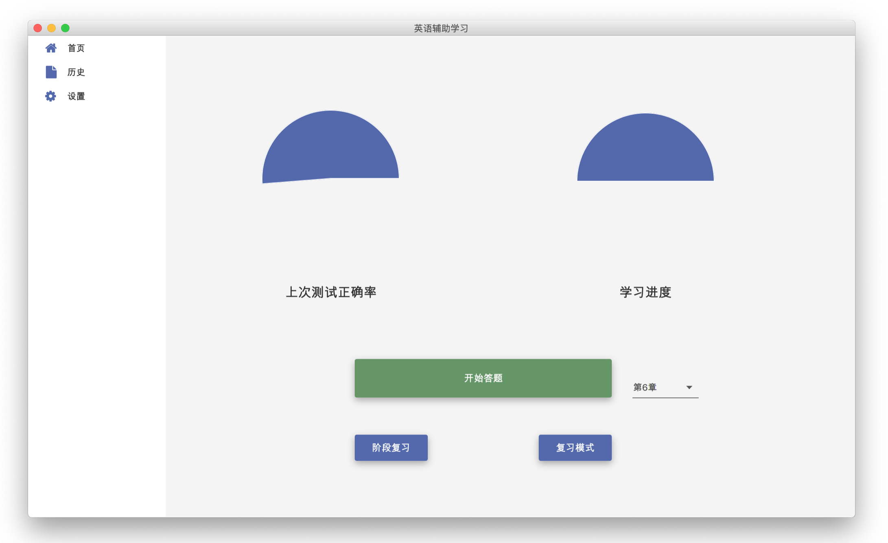

复习模式：会从历史完成过的习题库中随机选择一份习题，用户完成后同样会给予一定的激励语句和测试反馈，如果试卷完成情况良好，将刷新历史的正确率记录。

历史记录：显示用户的历史测试的情况，包括正确率、所属章节或模式、测试情况评价、鼓励语句、学习建议；点击进入查看详情，将会出现历史测试情况，用户的答案、正确的答案、习题的评价、习题所属章节、习题的难度等等，作文将会出现参考范文。

 

#### 实现解析

3.1 基础框架

在Java开发中，需要安装较多的依赖，所以选择了Maven作为项目管理工具，同时由于会出现较多的版本，为了便于代码的版本控制，采用了Git作为版本控制器。

为了实现上述需求分析中提到的功能，在学习完成Swing之后，发现其页面的具体样式调整限制较多，所以重新学习了甲骨文公司推出基于Java的GUI框架JavaFX，其最新版本为[JavaFX12](https://openjfx.io)，发布于2019年3月，该技术支持XML/CSS以及拥有较多支持开源UI，并且采用了其开源UI框架[Jfoenix](http://Jfoenix)来实现更好的页面效果。

在数据同步方面，为了兼容可能出现的跨平台同步，采用了远程MySQL数据库，通过Json进行数据交互。

 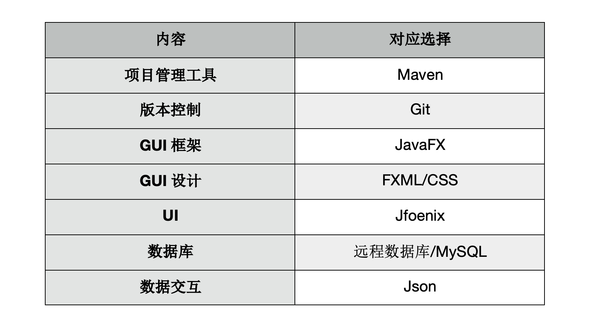 

3.2 逻辑框架

文件执行的结构基本如下，直接执行Main.java，调用Main.fxml，指向控制器MainController.java，管理程序的主页面切换、数据库连接、页面初始化，调用页面层添加到Main.fxml中，显示在Stage（程序页面）。页面层的Pages.java（各个页面管理器）也将调用components文件夹中的组件、或者直接通过定义样式加载显示在页面中。

底层包括css样式控制页面显示，Util工具帮助数据管理、进程控制、数据库连接，以及部分静态存储类用于存储全局数据或者辅助存储，比如用户信息、答案类型等等。

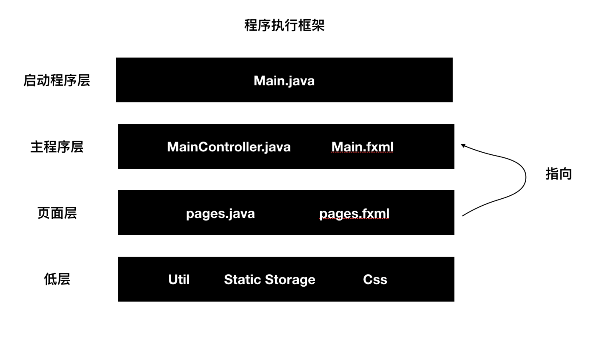

3.3 主程序说明

Main.java调用时，将通过MySqlUtil.java静态类进行数据库连接，将通过sql包进行连接，后续将不再需要重新连接，在程序关闭前，全局调用MySqlUtil中的update/insert/query等方法即可进行远程数据库操作。

同时，Main.java调用后，也将通过本地存储的id刷新用户的信息，刷新Static 的存储类User.java中的数据。通过FXMLLoader加载Main.fxml，指向调用MainController.java，并辅助加载css文件。

在Main.fxml中通过JFXListView建立了SiderBar进行页面控制，MainController.java中则预先加载了各个页面，并绑定了不同页面的navigator函数，便于后续的页面控制。

 

3.4 页面设计与功能

3.4.1 首页

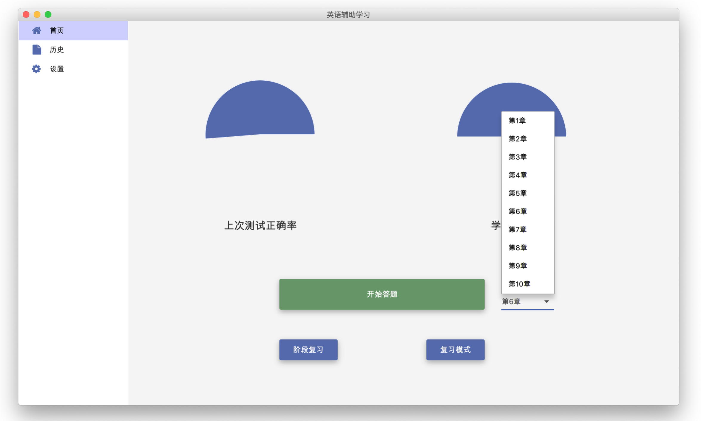 

首页的右侧内容通过UserAchieve.fxml与UserAchieveController进行控制，绑定点击事件与选择事件，通过调用mainController.java中的navigate函数进行页面的切换，通过Arc圆环显示进度。每次进入页面后都将请求刷新学习进度与正确率。

3.4.2 历史记录

 该页面通过History.fxml与HistoryControllser进行控制。使用泛类List<HistoryRecord> history_list进行存储，并通过JFXDialogLayout来包裹一次的记录，以达到循环加载历史记录的目的。

同时，通过具体的测试成绩、测试部分等因素展示测试情况，随机生成相关鼓励语句。

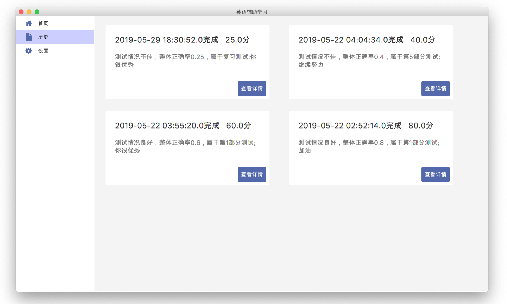

3.4.3 用户设置页面

该页面较简单，显示用户头像、通过slider控制试题难度、显示用户信息（加载时会刷新），如果选择自主难度，用户将可以自行调控试题难度，如果取消选择，将会采用系统根据历史的测试情况计算出的推荐难度。

 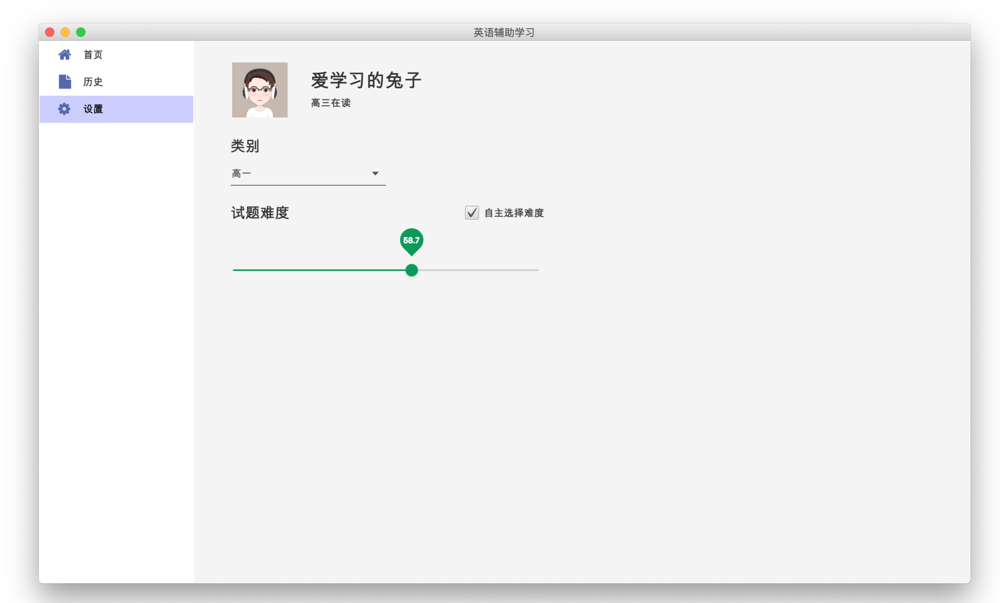

3.4.4 试卷页面

 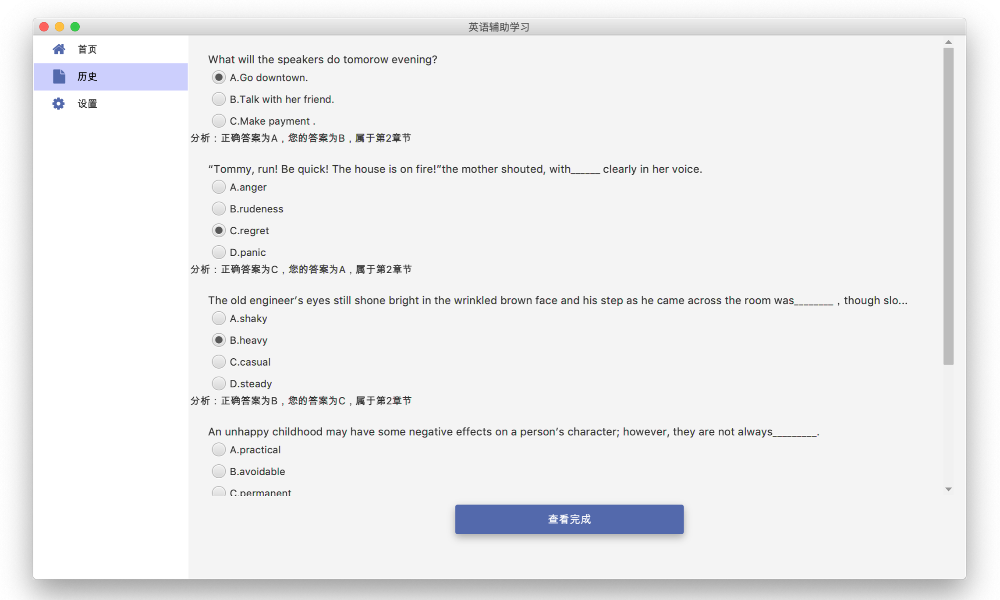

 

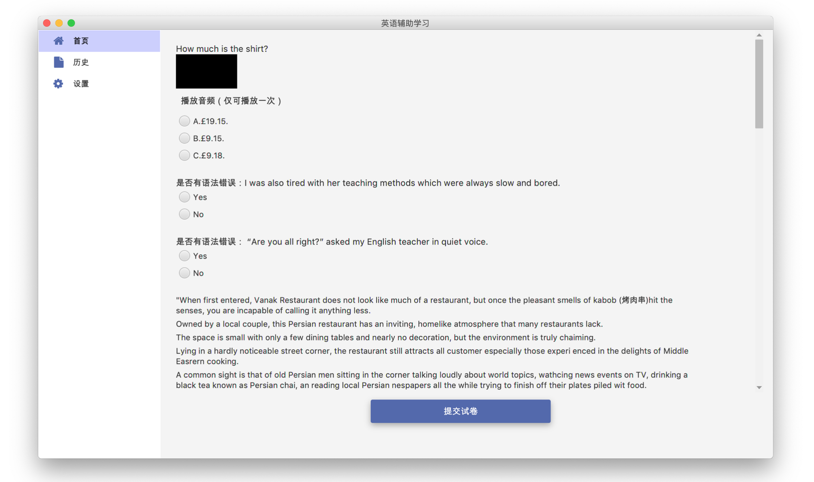

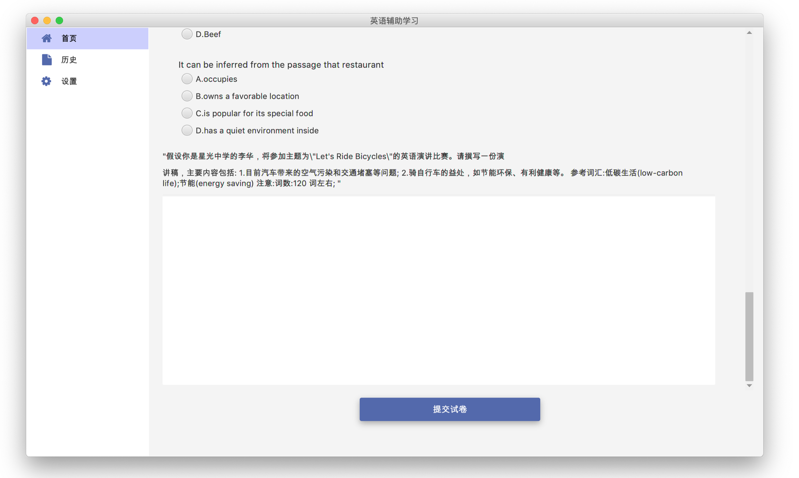

试卷页面通过QuizController进行控制，通过LoadPaper、LoadQuiz、LoadQuestion几种加载框架，加载阶段复习（试卷模式）、历史测试情况（包含答案解析）、普通测试。

用户点击提交后，提醒用户是否全部完成、该次测试的情况、是否有进步、需要怎么做，以及刷新数据库存储，重新计算用户的推荐难度，刷新UserAchieve中显示的各种信息。

QuizController将调用Components中的具体组件，比如Choose.fxml选择题、Comprehension.fxml阅读理解等，实现设计的复用性。同时，Controllers作为试卷的控制器，也存储了用户答案、正确答案等静态数据，在用户填写试卷的过程中，组件的数据会通过哈希表将数据进行存储。其中阅读理解通过module进行整体加载，内容包含选择题。

历史试卷中将显示用户选择以及正确答案，并给予相关的评价，比如试题的难度、试题所属的部分。

3.5 页面互调

3.5.1 页面间调用

页面间调用分为可以设置为静态的函数与不可设置为静态的函数。

可以静态调用的函数，比如调用首页的用户信息加载函数等，可以直接通过import调用即可。

不可直接调用的函数，比如mainController.java中的切换页面，不支持static调用，所以需要通过injectController进行页面指向的设置，在mainController调用时，也将调用inject函数，使其他的Controller可以调用main中的函数

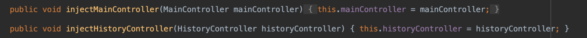

3.5.2 页面交互事件

页面中存在点击事件、选择事件、拖动事件等，JavaFx中的事件绑定与Swing中稍微有区别。

部分事件可以采用fxml绑定实现，部分事件需要比如selectedToggleProperty()后addListener进行监听。

3.6 数据存储

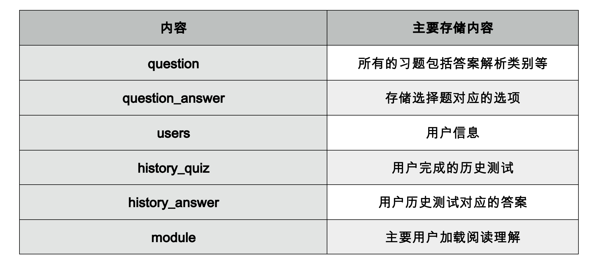

为了方便进行数据的调用，在该程序中使用了较多的数据类型。以下选择部分进行说明。

答案存储：HashMap、泛型，比如QuizController.java中的public static Map<Integer,String> *answers* = new HashMap<Integer, String>()，每次完成习题后都将put进入数据，比较答案时直接通过key对比即可。

历史情况存储：List、泛型，比如HistoryController.java中的List<HistoryRecord> history_list=new ArrayList<HistoryRecord>()，historyRecord是为了便于存储历史情况设计的一个类。

**MySql**数据交互：使用了JsonObject和JsonArray进行数据交互。

页面显示：使用了泛型进行数据交互，比如root.getChildren.add()就是获得子节点，并添加子节点，子节点为泛型。

3.7 远程数据库

数据库采用远程数据库，存在云端，直接通过ip地址进行连接。

数据库分为question, question_choice, uesers, history_quiz, history_answer, module五个table。

| 内容            | 主要存储内容                 |
| --------------- | ---------------------------- |
| question        | 所有的习题包括答案解析类别等 |
| question_answer | 存储选择题对应的选项         |
| users           | 用户信息                     |
| history_quiz    | 用户完成的历史测试           |
| history_answer  | 用户历史测试对应的答案       |
| module          | 主要用户加载阅读理解         |

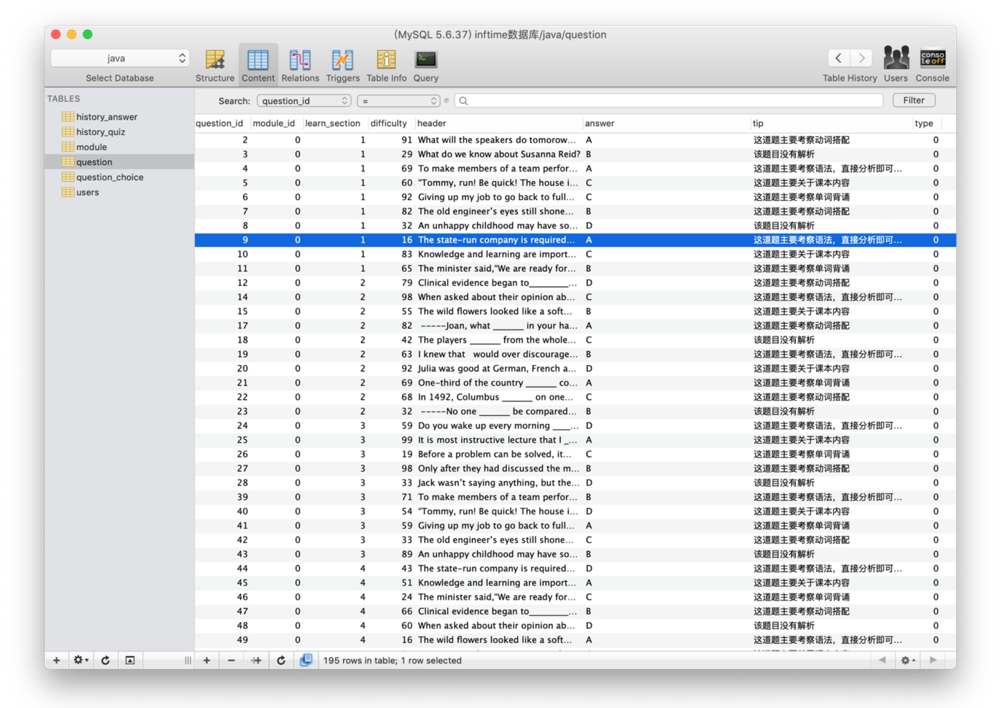

3.7 其他实现

3.7.1 计时程序（多进程）

在页面开始时调用了Util/Tread.java创建了一个新的进程，使用多进程进行页面使用时间的记录。

3.7.2 ICON FONT

通过引入fontawesomefx，可以直接在fxml中引用FontAwesomeIconView设置按钮样式。

3.7.3 页面类的Implement

Controller中应用Initializable，然后@overrider进行initialize的重写来实现页面初始加载的目标。

3.7.4 页面CSS控制

css文件夹中引入了部分自主设计和开源的CSS样式，优化页面。

3.7.5 jfoenixUI框架

通过建立 jfoenix依赖，引入其UI框架。

 

#### 小结及回顾

在此次的软件开发中，主要问题在于题目反馈仍然不够智能化，但是基本实现了所需要的全部功能，并且保证了一定的美观性。

同时在此次开发中，我也进一步了解了Java进程控制的问题、Java程序接口、Java项目管理与依赖建立、Java的群体数据/泛型等数据类型、xml的相关操作、css样式设计、使用Java操作数据库、Java Project中的类的相互调用、Java绘图、设计模式等知识，并且对Java GUI开发有进一步的理解。受益匪浅。